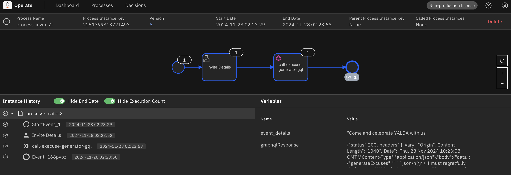

inspired by Get Started with Started Camunda 8 Docs
https://docs.camunda.io/docs/next/guides/getting-started-java-spring/

JDK 21
Spring Boot latest non-snapshot
Camunda Modeler
Camunda Run
used `camunda8-run-8.7.0-alpha1-darwin-x86_64.tar.gz` for local install of Camunda Run 8.7.0-alpha1

- took a while to find the right version

```bash
c8run % ./start.sh
```

should see the following output:

```bash
Camunda has successfully been started.

-------------------------------------------
Access each component at the following urls:

Operate:                     http://localhost:8080/operate
Tasklist:                    http://localhost:8080/tasklist
Zeebe Cluster Endpoint:      http://localhost:26500
Inbound Connectors Endpoint: http://localhost:8085

When using the Desktop Modeler, Authentication may be set to None.
```

[When COnfiguring the Zeenbe client](https://docs.camunda.io/docs/next/guides/getting-started-java-spring/#configure-the-zeebe-client)

```yaml
camunda:
  client:
    mode: self-managed
    zeebe:
      enabled: true
      grpc-address: http://127.0.0.1:26500
      rest-address: http://127.0.0.1:8080
```

and using a .properties file insteadof yaml then use:

```
camunda.client.mode=selfmanaged
camunda.client.zeebe.enabled=true
camunda.client.zeebe.grpc-address=http://127.0.0.1:26500
camunda.client.zeebe.rest-address=http://127.0.0.1:8080
```

## process invites - call to GraphQL endpoint

Using the GraphQL endpoint to get the invite response where the endpoint is hosted by a [Modus](https://docs.hypermode.com/modus/overview) application - [modus-excuse-generator](https://github.com/KazChe/modus-excuse-generator) which then asks OpenAI to generate couple of excuses.

for now created the process in the camunda modeler and then exported the bpmn file and placed in src/main/resources/process-invites2.bpmn along with a form event_details.form

Both have been tested manually.

TODO:

- create an external custom web application to host the form as Camunda supports [starting processes from external forms](https://camunda.com/blog/2023/10/start-camunda-process-external-form/).
- Use Java/Spring Zeebe SDK to interact with Camunda
- Deploy using Spring Zeebe SDK instead of via Modeler

Sample response from the GraphQL endpoint:



````json
{
  "status": 200,
  "headers": {
    "Vary": "Origin",
    "Content-Length": "1040",
    "Date": "Thu, 28 Nov 2024 10:23:58 GMT",
    "Content-Type": "application/json"
  },
  "body": {
    "data": {
      "generateExcuses": "```json\n[\n \"I must regretfully decline your YALDA invitation because I have entered into an exclusive, long-term contract with a secret society of vampire librarians. They need me to translate their ancient scrolls into modern emojis, and it turns out the longest night of the year is when they get the most 'lit'. My absence would surely result in a catastrophic, apocalyptic reading room riot, and nobody wants that kind of chaos over a fruit platter, right?\",\n \n \"Unfortunately, I won’t be able to attend YALDA this time as I am on a quest to recover my stolen shadow from a league of interdimensional narwhals. Somehow, they’ve mistaken it for the mythical 'Night-Sparkle Luminance' which they intend to use to overthrow Neptune's throne. I’m afraid dealing with a potential cosmic marine monarchy crisis takes precedence over munching on watermelon, though I hear the seeds are quite tasty.\"\n]\n```"
    },
    "extensions": {
      "invocations": {
        "generateExcuses": {
          "executionId": "ct449e3s4hmi2mc1a5gg"
        }
      }
    }
  },
  "reason": "OK"
}
````
